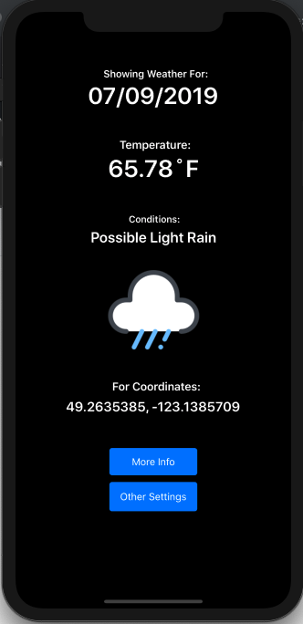
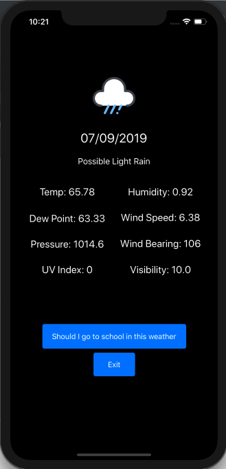
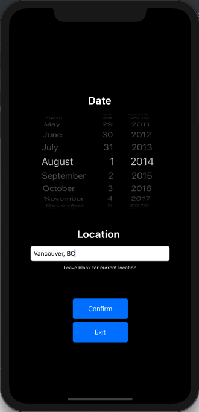
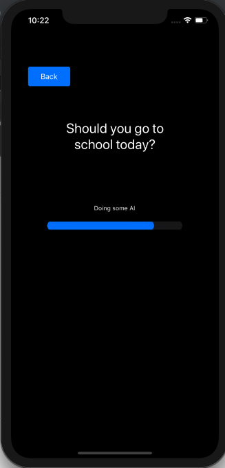
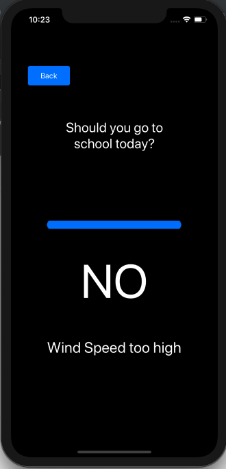

# Dark Sky

In our final MDB project, we used the Dark Sky API to display information about the weather conditions and forecast. This application reports weather conditions for any location at any time that the user specifies into the options page. It also pinpoints the user's location and provides conditions based on his or her coordinates and time. I also implemented a feature to tell the user whether or not it was safe to go to school on that given day using some metrics found within the API.

## Main Weather Display
This view displays all of the most prominent information for the specified dates and times, including temperature in Fahrenheit, date, and given coordinates. It also has a handy icon to inform the user.\n

## Further Weather Details
This view displays even more details about the weather conditions for the given day and time. It has more obscure data, such as wind speed, wind bearing, and visibility. It presents the additional feature that I added to check if users are safe to go to school.\n

## Options Page
This view gives the users options to select from - allowing users to input any city at any date. The application takes these inputs into consideration when displaying the main weather display.\n

## Additional Feature - Should you go to school?
This feature calculates data fetched from the API call to tell the user whether or not it's safe to go to school. For example, if the wind speed is too high, or the temperature is too extreme, the user is advised to stay home.\n

## Additional Feature - Result
The application makes sure to tell the user why it's better to stay home on a given day. For example, this shows "Wind speed too high" as a result of the call. If it were safe, a big YES would be displayed with no message underneath it.\n

